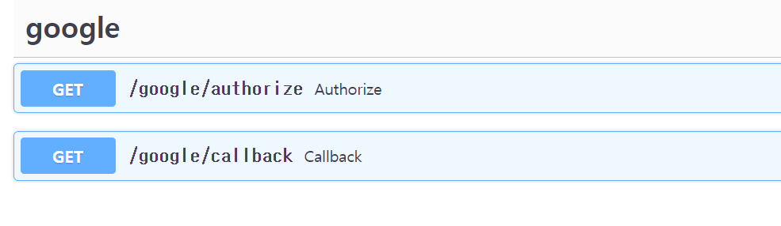

# Getting started

## Installation
First of all, you need to install fastapi-allauth.

```sh
pip install fastapi-allauth
```

## Minimum Example
`Villain Fastapi Allauth` provides several ready-to-use clients.

Here is an example of google oauth to start with.

=== "app/models.py"

    ```py

    from fastapi_allauth.model.BaseUser import BaseUser, Base

    class CustomUser(BaseUser):
        # defalut payload only has an ID
        # update your payload
        payload = {
            "custom": "custom"
            ... 
        }

        # If additional columns are needed, add them.
        
    ```

=== "app/main.py"

    ```py

    from fastapi import FastAPI
    from fastapi import APIRouter

    from fastapi_allauth.oauth import GoogleOauth
    from fastapi_allauth import AllauthManager

    from db import engine, SessionLocal
    from models import CustomUser, Base

    Base.metadata.create_all(bind=engine)
    
    ...

    JWT_SECRET = 'your secret'
    allauthManager = AllauthManager(db=get_db(),
        user=CustomUser, secret=JWT_SECRET, lifetime_second=3600)

    googleOauth = GoogleOauth(
        provider="GOOGLE",
        client_id="your client",
        client_secret="your secret",
        redirect_uri="http://localhost:8000/google/callback",
        scope=["openid", "email", "profile"]
    )

    app.include_router(allauthManager.get_oauth_router(
        googleOauth), prefix="/google", tags=["google"])

    ```


